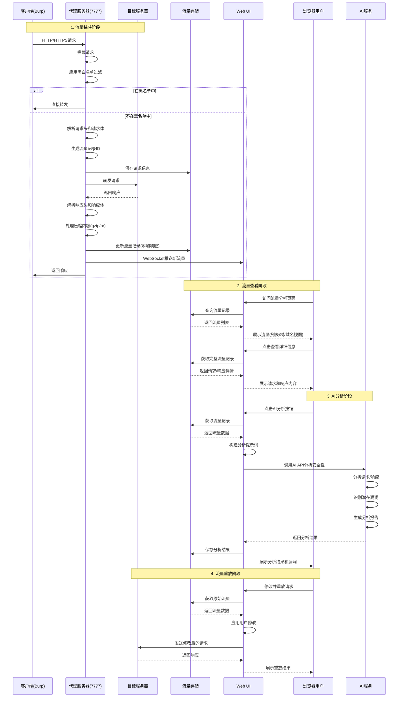

# Scan-X 最新版本V6.0

最新介绍文章：https://mp.weixin.qq.com/s/zqTliLgVBimelAUQ26RgIw

推荐模型：https://github.com/Clouditera/SecGPT


Scan-X是一款基于mitmproxy高效的被动扫描器，专注于快速识别常见Web漏洞，包括SQL注入、越权访问、未授权访问等。通过代理模式自动分析HTTP流量，实现被动扫描，适合大规模资产安全评估与渗透测试场景。


```
更新记录：

V6.0：流量审计、JSSS接口自动化测试

V5.6：适配本地ollma模型（需要在配置文件中增加延时时间，具体配置参考使用手册最后部分）

V5.5：优化提示词、web界面（新增任务进度、AI对话助手、数据包扫描）

V5.2：Kali-MCP自动化渗透
```

### 扫描模块详细功能

####  AI智能扫描模块

| 模块名称           | 检测类型   | AI能力                                        | 状态 |
| ------------------ | ---------- | --------------------------------------------- | ---- |
| SQL_AIagent        | SQL注入    | 智能payload生成、时间盲注、布尔盲注、报错注入 | ✅    |
| XSS_AIagent        | 跨站脚本   | 反射型XSS、存储型XSS、DOM型XSS                | ✅    |
| RCE_AIagent        | 命令注入   | 命令执行、代码执行、OGNL注入                  | ✅    |
| Privilege_AIagent  | 越权检测   | 水平越权、垂直越权                            | ✅    |
| Upload_AIagent     | 文件上传   | 文件上传漏洞、文件读取、目录遍历              | ✅    |
| WAF_Bypass_AIagent | WAF绕过    | 智能绕过WAF防护                               | ✅    |
| CVE_AIagent        | CVE漏洞    | 已知CVE漏洞检测                               | ✅    |
| Bypass403_AIagent  | 403绕过    | 403状态码绕过                                 | ✅    |
| Fuzz_AIagent       | 模糊测试   | AI辅助模糊测试                                | ✅    |
| JSSS_AIagent       | JS智能扫描 | JavaScript代码分析、API测试                   | ✅    |
| JSSSVUL_AIagent    | JS漏洞测试 | JavaScript上下文漏洞检测                      | ✅    |
| DIY_AIagent        | 自定义检测 | 用户自定义检测规则                            | ✅    |

####  传统扫描模块

| 模块名称     | 功能说明                    | 特点                  |
| ------------ | --------------------------- | --------------------- |
| SQL基础注入  | 基于规则的SQL注入检测       | 快速、误报率低        |
| 敏感信息检测 | 检测API密钥、密码等敏感数据 | 正则匹配、自定义规则  |
| 指纹识别     | Web应用指纹识别             | 基于finger.json指纹库 |
| 越权检测     | 水平/垂直越权               | 基于角色令牌检测      |


### 流量代理与分析流程




